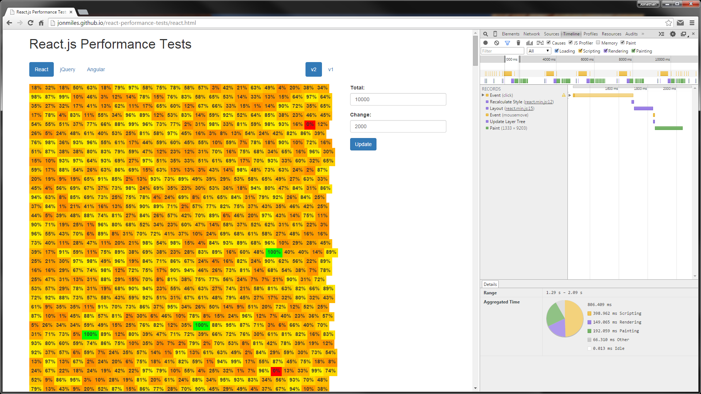

# React.js Performance Tests

The main objective was to test React.js’ relative performance of rendering browser updates against comparable frameworks, or approaches.  

Live Demo - [http://jonmiles.github.io/react-performance-tests](http://jonmiles.github.io/react-performance-tests)

## Framework Selection

**React.js** was a given, the whole point of exercise was to test whether React.js would live up to the hype the Facebook team presented.

**jQuery** was the next obvious choice, as I have a lot of experience developing web components using jQuery and direct DOM manipulation.

Finally, I wanted to ensure I compared React against another modern framework.  My decision to choose **Angular.js** was straight forward, from my experience it’s one of the most popular frameworks around; quickly confirmed by its popularity on [GitHub](https://github.com/showcases/front-end-javascript-frameworks).

## Considerations

### Fairness

The test scenario was purposely kept as simple as possible, in order that the implementation would translate as cleanly as possible between test frameworks.  I wanted to try and avoid introducing any unfair scenarios where one approach had a particular niche, or needed any complex implementation strategy.

### Real World Scenario

I wanted to make the test scenario as real world as possible, the test’s had to be a practical application.  

Over the past 10+ years I’ve been involved in the development of real-time dashboards, which typically involves a lot of high frequency page  updates.  It was based on this experience that I decided the test scenario would be dashboard related.  The implementation would be simply but would be designed to stress test the respective frameworks.

## Implementation

A very basic dashboard, a grid of elements which update themselves based on state related data.  Each element would be responsible for displaying two things 1. a percentage value between 0 and 100, 2. a colour associated with this value.  Both data values would be provided by the data generated, all the dashboard has to do is represent these values visually.

The data would be generated independently of the dashboard implementation and each implementation would make the same data request.  There should be no advantage gained by either implementation.  In order to test different scenarios, I made the size of the grid and the number of changes configurable via the test interface.

You can view the code implementation in this project, and a live demo is available to view [here](http://jonmiles.github.io/react-performance-tests).

## Results

The below sample test results were generated based on a total of 10,000 dashboard elements, with a random 20% of those elements being updated on each update.

Tests where run using Chrome and the Developer Tools Timeline.

Tests where run 5 times against each approach to provide an average and to allow for any data anomalies.

### React.js

| #  | Rendering | Painting | Results |
| --- | ----- | ------ | ------------ |
| 1  | 149ms  | 192ms  | [View](results/react-v2-timeline-1.PNG)  |
| 2  | 148ms  | 187ms  | [View](results/react-v2-timeline-2.PNG)  |
| 3  | 161ms  | 206ms  | [View](results/react-v2-timeline-3.PNG)  |
| 4  | 153ms  | 190ms  | [View](results/react-v2-timeline-4.PNG)  |
| 5  | 152ms  | 190ms  | [View](results/react-v2-timeline-5.PNG)  |
| **Avg** | **152ms**  | **193ms**  |   |

### jQuery

| #  | Rendering | Painting | Results |
| --- | ----- | ------ | ------------ |
| 1  | 334ms  | 190ms  | [View](results/jquery-v2-timeline-1.PNG)  |
| 2  | 360ms  | 186ms  | [View](results/jquery-v2-timeline-2.PNG)  |
| 3  | 359ms  | 189ms  | [View](results/jquery-v2-timeline-3.PNG)  |
| 4  | 365ms  | 195ms  | [View](results/jquery-v2-timeline-4.PNG)  |
| 5  | 355ms  | 182ms  | [View](results/jquery-v2-timeline-5.PNG)  |
| **Avg** | **354ms**  | **188ms**  |   |

### Angular.js

| #  | Rendering | Painting | Results |
| --- | ----- | ------ | ------------ |
| 1  | 181ms  | 255ms  | [View](results/angular-v2-timeline-1.PNG)  |
| 2  | 183ms  | 249ms  | [View](results/angular-v2-timeline-2.PNG)  |
| 3  | 184ms  | 264ms  | [View](results/angular-v2-timeline-3.PNG)  |
| 4  | 184ms  | 274ms  | [View](results/angular-v2-timeline-4.PNG)  |
| 5  | 185ms  | 265ms  | [View](results/angular-v2-timeline-5.PNG)  |
| **Avg** | **183ms**  | **261ms**  |   |
  

These results are only a small test sample with fix parameters.  I did run separate tests with different parameters, browsers etc. but as a whole the result above held up.  However, you may get different results so please feel free to test it yourself using the [live demo](http://jonmiles.github.io/react-performance-tests).

## Conclusion

React was certainly faster the jQuery approach, in fact on average more than twice as fast.  In a way that was to be expected, as jQuery has no fancy update implementation (e.g. Shadow DOM) and literally rebuilds the entire grid on each render.  That said, if we're only updating 20% of the rendered elements then logically I would have expected it to be more like 5 times faster.

On the other hand React's performance was much more comparable with Angular.  No major surprise as they both claim to take a Shadow DOM approach to rendering updates.  The results above show that React has a clear, albeit marginal advantage.  However that wasn't always the case, in most instances Angular was almost as fast, in some instances Angular was actually faster but never by much.

As a side note on reliability, on several occasions during testing the jQuery approach actually crashed the browser.  Typically this was when dealing with very large data sets, 10,000 total elements and over.  This was not something I experienced while testing React or Angular.